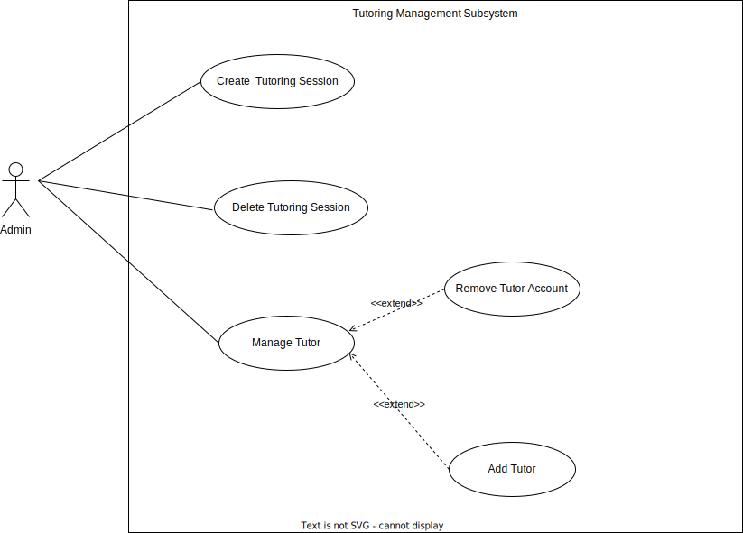

# Updated Problem Statement, Proposed Solution And Use Cases

## Problem statement

In trying to minimize the unemployment rate, some people with skills and knowledge resort to independant tutoring but they often struggle to find students to tutor due to lack of information about already existing websites for tutoring.When they do find students,they need to travel far to meet with their students.Students sometimes struggle to find tutors catered to their specific needs.

## Proposed solution

A proposed solution would be to create a website and a mobile application that connects students to tutors based on the tutor's field of knowldge. By doing this, we minimize the need for extensive travel between students and tutors. We hire skilled people to partake in assisting students with various subjects or modules that they need help with. Prospective tutors can sign up, add their Curriculum Vitae and qualifications to our system. They will be vetted by a quiz in which they would need to score 65% or above for them to be added as tutors to our system. Students can also sign up and book a session on a pay-per request basis. The students will be allowed to choose their own tutor and their preferred private session online.Free Cancellations are allowed 24 hours before the sessions, but there will be a charge fee of 10% for a last-minute cancellation.

## Use Cases

### User Management

#### Below is the subsystem for user management of the system.

Actors: Admin, Student and Tutor.

Goal: For users to register, Login and manage the account by either deleting the account or edit account.

Description: A user will register the required information on the system. A profile on the system will be created, allowing them to login onto the system any time they want. Once logged in, they will be able to manage their account on the system, they will be able to delete their account or make changes to it.

### Use Case: Create Account

Input as Admin: Email Address, Full Name, and Password.

Input as Client: Email Address, Full Name, Address and Password

Output: Status of new creation

1. User selects "Sign Up"
2. User enters required information to register
3. User clicks on "Submit"
4. System verifies email address
5. System creates account for the user
6. System redirects user to login page

### Extensions

1a. Email Address already exists

1. System redirects user to the login page

1b. Password/email does not match requirement criteria

1. System requests user to re-enter his/her details
2. User enters new password

1c. Valid email address and password

1. System creates new account for the user
2. Redirect user to the login page

### Use Case: Login

Input: Email Address And Password

Output: Logged in user

1. User selects "Sign In"
2. User enters email address and password
3. System verifies email address and password
4. System redirects to User Specific Home page

### Extensions

1a. Email address does not exist

1. System request user to re-enter details

1b. Password is incorrect

1. System requests the user to re-enter the password

1c. User account has been suspended

1. System requests the user to contact adminstration

### Use Case: Manage Account

Input: Click "Profile"

Output: View profile

1. User selects "Profile"
2. User selects "Manage Account"
3. System displays "User Account"
4. User clicks "Submit"

### Extensions

3a.User selects "Delete profile"

1. System prompts the user to confirm profile deletion
2. User confirms Profile deletion
3. System removes user profile
4. User cancels profile deletion
5. System redirects back to "Manage Account" page

3b. User selects "Edit profile"

1. User makes changes to details
2. User clicks submit
3. System updates and saves the new changes

### Booking Management

#### Below is the subsystem for booking management of the system.

Actors: Student, Google API and Payment gate

Goal: For students to book tutoring session

Description: A student will select a subject they require a tutor for, specify location then google maps will show locations of tutors closest to them. Once the booking is added, then the student will be able to manage their booking

### Use Case: Select Module

Input : Module Name

Output: All available modules

1. Student selects "Find Modules"
2. System displays a list of all available modules
3. Student selects the module
4. User sends "Select Module"
5. System receives "Select Module"

### Use Case: Find Location

Input: Student's Location

Output: All available tutors close to the student

1. Student enters their current location
2. Student clicks "Search"
3. System calls google maps API for location address
4. System displays all tutors available around the current location of the student

### Extensions

3a. Google maps does not find the location

1. System displays that location 'not found' and requests user to re-enter location

3b. Tutors not found on location

1. System displays friendly message to show there are no available tutors around and display alternative tutors

### Use Case: Select Tutor

Input: Tutor information

Output: Tutors' details page

1. Student selects a tutor from a list view
2. System displays a page with selected tutor information
3. Student clicks "Add Booking"

### Use Case: Add Booking

Input: Booking Details

Output: Booking Status

1. Student clicks "Add Booking"
2. System shows form to enter booking details
3. Student enters booking details: date, time and duration of the session
4. System shows the estimated calculated price of the session
5. User confirms booking
6. System redirects user to payment page
7. Student makes payment
8. System sends booking confirmation to student email
9. System notifies Tutor about pending session

### Extensions

1a. Student cancels/deletes booking

1. Student clicks "Cancel Booking"
2. System changes booking status to be cancelled

### Tutoring Management

#### Below is the subsystem for tutoring management of the system.

Actors: Admin

Goal: For the admin to manage the tutoring sessions

Description: The admin will create the tutoring sessions on the dashboard. They will then be able to manage sessions by allowing the students to see the available tutors and also manage problems encounted during a session. The admin will be able to generate reports about how many students requested a tutor, and how many sessions did a tutor have

### Use Case: Create Tutoring Session

Input: Session Details

Output: Display a table showing tutoring session types information created

1. Admin enters the type of tutoring session
2. Admin creates new session

### Extensions

1a. Face to face session type

1. System sends student unique code during session

1b. Online tutoring

1. Admin facilitates the online session

### Use Case: Manage Tutoring Session

Input: Session ID

Output: Newly added information appears in the session types table

1. Admin clicks "Manage Session"
2. System displays a form with session details
3. System updates the session type table with new added information

### Extensions

2a. Admin edits session

1. Admin enters new details
2. Admin clicks "Save Changes"

2b. admin deletes session

1. Admin clicks "Delete Session"
2. System removes tutoring session information

### Use Case: Add Tutors

Input: Tutor's information

Output: Newly added Tutors to the system

1. Admin clicks "Add Tutor"
2. System displays tutor profile
3. Admin reviews tutor qualifications and quiz results
4. Tutor is added to system

### Extensions

3a. Admin is not satisfied with the qualifications

1. Declines application

3b. Admin is satisfied with the qualifications

1. System generates the quiz specific for the module

### In Session Management

#### Below is the subsystem for user tutoring management of the system.

Actors: Student and Payment Gate

Goal: For students to be able to manage their tutoring sessions

Description: A student can make changes during the session. Like extending the duration of the system at extra cost

### Use Case: Extend session time

Input: Date and Time

Output: Updated Date and Time for the extended session

1. Student clicks "Extend time"
2. Student inputs preferred time
3. System verifies the time
4. Student clicks confirm time
5. System updates time
6. System redirects to payment page

### Extensions

3a. Tutor confirms the session

1. Admin extends tutoring time

3b. Tutor declines the session

1. System notifes student that tutor declined

### Use Case: Make Payment

Input: Payment Details

Output:

1. Student clicks "Make Payment"
2. System redirects the student to payment gate
3. Student enters payment details
4. Student clicks "Submit details"
5. System verifies details
6. Payment gate processes the payment
7. Payment gate sends the payment response
8. System receives payment response
9. System issues reference code

### Extensions

8a. Payment not approved

1. System displays "payment declined"

8b. Payment approved

1. System displays "payment accepted'

### Invoice Management

#### Below is the subsystem for invoice management of the system.

Actors: Admin

Goal: For the student to be able to view their previous session and billing within the system and for the admin to be able to keep track of the invoices

Description: The admin will generate invoices and send it to the student. Should there be faults with the invoices, the admin will be able to update or delete the invoices

### Use Case: Generate Invoice

Input: Payment Details

Output: Invoice details

1. Admin clicks "Invoices"
2. System displays invoices
3. Admin clicks "View invoice"
4. System verifies invoice details
5. System displays invoice

### Extensions

5a. Invoice does not match session booking

1. Admin deletes invoice and generates new one

### Use Case: Manage Invoice

Input: Invoice ID

Output: Invoice details

1. Admin clicks "Manage Invoices"
2. System displays all invoices
3. Admin selects invoice
4. Admin views invoice
5. System saves changes

### Extensions

4a. Admin edits invoice

1. Admin makes changes to the invoice

4b. Admin deletes invoice

1. System removes the invoice

### Report Management

#### Below is the subsystem for report management

Actors: Admin

Goal: For the student to be able to view their previous session and billing within the system and for the admin to be able to keep track of the reports.

Description: The admin will generate reports and send it to the stakeholders. Should there be faults with the reports, the admin will be able to update or delete the reports.

### Use Case: Generate Reports

Input: Report ID

Output: Reports details

1. Admin clicks "Reports"
2. System displays Reports
3. Admin clicks "View Reports"
4. System verifies reports details
5. System displays reports

### Extensions

5a. Reports does not match session booking

1. Admin deletes Reports and generates new one

### Use Case: Manage Reports

Input: Report ID

Output: Reports details

1. Admin clicks "Manage Reports"
2. System displays all reports
3. Admin selects reports
4. Admin views reports
5. System saves changes

### Extensions

4a. Admin edits reports

1. Admin makes changes to the reports

4b. Admin deletes reports

1. System removes the reports

# Component & Deployment Diagram

# Comprehensive Verification and Validation (V&V) plan

